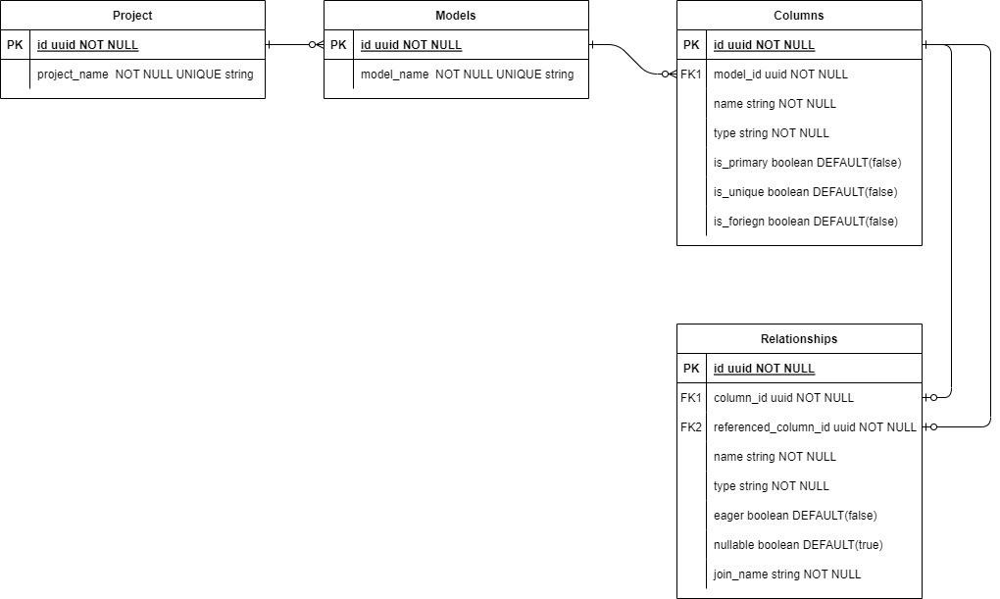

  <!--[](https://opencollective.com/nest#backer)
  [](https://opencollective.com/nest#sponsor)-->

## Description

This is a project that intends to create an API that enables to design and create a simple NestJS CRUD api server. 

## Database Design
The database design can be found below.



## Installation

```bash
$ npm install
```

## Running the app

```bash
# development
$ npm run start

# watch mode
$ npm run start:dev

# production mode
$ npm run start:prod
```

## Dependencies
  - <a href='https://www.postgresql.org/'>`PostgresSQL`</a> :  is a free and open-source relational database management system (RDBMS) emphasizing extensibility and SQL compliance.
  - <a href='https://typeorm.io/'>`TypeOrm`</a> :  an ORM for communicating with the database.
  - <a href='https://github.com/timgit/pg-boss/blob/master/docs/readme.md'>`pg-boss`</a> :  a job queue built in Node.js on top of PostgreSQL in order to provide background processing and reliable asynchronous execution to Node.js applications.
  - <a href='https://handlebarsjs.com/'>`HandleBars`</a> : a templating engine for Node.js applications.

## License

Nest is [MIT licensed](LICENSE).
